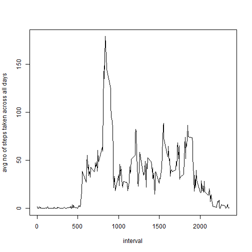

Reproducible Research Assignment 1
===================================


####1. Loading and preprocessing the data


```r
library(sqldf)
activity <- read.csv("activity.csv")
modified_activity <-activity
modified_activity[is.na(activity)]<-0
```


            

####2. What is mean total number of steps taken per day?
a. Histogram of the total number of steps taken each day

```r
DF1 <- sqldf("SELECT sum(steps) as a, 'Original' as cond FROM  modified_activity group by date")
hist(DF1$a, xlab="total number of steps taken each day",main="")
```

 


b. The mean and median total number of steps taken per day

```r
my_mean<-round(mean(DF1$a),digits=0)
my_median<-round(median(DF1$a),digits=0)
```
The mean total number of steps taken per day (round up) is 9354 and the median total number of steps taken per day (round up) is 10395.
  

####3. What is the average daily activity pattern?
a. Time series plot of the 5-minute interval and the average number of steps taken across all days 

```r
DF3 <- sqldf("SELECT avg(steps) as average, interval as interval FROM modified_activity group by interval")
plot(DF3$interval, DF3$average, type="l", xlab="interval", ylab="avg no of steps taken across all days ")
```

 

b. Which 5-minute interval, on average across all the days in the dataset, contains the maximum number of steps?

```r
my_max<-DF3$interval[which.max(DF3$average)]
```
The interval 835 has the maximum number of steps average across all the days in the dataset.

####4. Inputing missing values
a. Calculate and report the total number of missing values in the dataset 

```r
my_na <-is.na(activity$steps)
my_na_len <-length(activity[my_na,1]) 
```
The total number of missing values in the dataset is 2304

b. Devise a strategy for filling in all of the missing values in the dataset.

```r
filled_steps<-activity$steps
for(i in 1:nrow(activity)) {
        if (is.na(activity[i,1])){
		filled_steps[i]<-floor(DF3[which(DF3$interval %in%  activity[i,3]),1])
	}
}
```

c. Create a new dataset that is equal to the original dataset but with the missing data filled in.

```r
new_activity<-cbind(activity,filled_steps)
```

d. Make a histogram of the total number of steps taken each day

```r
library(ggplot2)
DF4 <- sqldf("SELECT sum(filled_steps) as a, 'Filled' as cond FROM new_activity group by date")
combined <- rbind(DF1,DF4)
ggplot(combined, aes(x=a))+ geom_histogram()+facet_grid(. ~ cond)+labs(x="total number of steps taken each day")
```

 


By replacing "NA" with the mean of 5-minute interval, the frequencies changes. As seen from the histogram, the frequence of "0" as total number reduces and there is an increase in frequencies for some values of the total number.

####5. Are there differences in activity patterns between weekdays and weekends?
a. Create a new factor variable in the dataset with two levels -- "weekday" and "weekend"

```r
library(timeDate)
my_date<-modified_activity$date
weekday_cat<-sapply(my_date,function(x) if(isWeekday(as.Date(x))){"weekday"}else{"weekend"}  )
weekday_activity<-cbind(modified_activity, weekday_cat)
```

b. Make a panel plot containing a time series plot

```r
library(lattice)
DF5 <- sqldf("SELECT avg(steps) as average, interval as interval, weekday_cat as weekday_cat FROM weekday_activity group by interval, weekday_cat")
xyplot(average ~ interval | weekday_cat, data = DF5, layout = c(1, 2),type="l",ylab="Number of steps",xlab="Interval")
```

 
